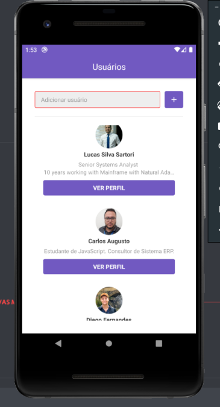
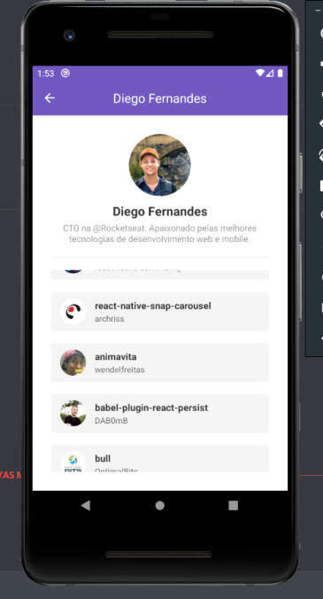
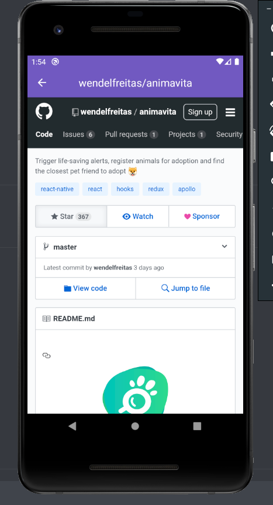

<h1 align="center" >
    
  Bootcamp 9.0 da <a text-decoration="none" href="https://rocketseat.com.br">:rocket: Rockeseat</a> - Desafio 6: Primeiro projeto com React Native
</h1>
<h2 align="center">
    
</h2>

<blockquote align="center">“Feito é melhor doque perfeito!"</blockquote>

  

  
  

  

  <a href="#1---sobre-o-desafio">Sobre o desafio</a>&nbsp;&nbsp;&nbsp;|&nbsp;&nbsp;&nbsp;
  <a href="#2---tecnologias">Tecnologias</a>&nbsp;&nbsp;&nbsp;|&nbsp;&nbsp;&nbsp;
  <a href="#3---funcionalidades">Funcionalidades</a>&nbsp;&nbsp;&nbsp;|&nbsp;&nbsp;&nbsp;
  <a href="#4---apresentação">Apresentação</a>&nbsp;&nbsp;&nbsp;|&nbsp;&nbsp;&nbsp;
  <a href="#5---executar-aplicação">Executar aplicação</a>

## 1 - Sobre o desafio

Nesse desafio foi criada uma aplicação mobile para inclusão de usuários cadastrados no GitHub e consultar os repositórios marcados com Stars por cada usuário.

## 2 - Tecnologias

O Projeto desenvolvido em ReactJS com aplicação de diversas tecnologias e bibliotecas.

  - react-native
  - axios
  - prop-types
  - react-icons
  - styled-components
  - eslint
  - prettier
  - editorconfig

## 3 - Funcionalidades

  - Inclusão de usuários do GitHub através da consulta da API usuários.
  - Gravação dos usuários no Local Storage do dispositivo.
  - Listagem dos usuários incluidos.
  - Tratamento de exceção.
  - Listagem dos repositórios marcados com star pelo usuário selecionado.
  - Paginação dos repositórios.
  - Seleção dos repositórios. Ao selecionar o repositório o mesmo será aberto através de WebView.

## 4 - Apresentação

<ol>
  <li>Tela principal para inclusão e listagem dos usuários.</li>
  <li>Tela de repositórios marcados com star pelo usuário selecionado.</li>
  <li>Tela para o detalhamento dos repositórios aberto através de WebView.</li>
</ol>
<table style="width:100%">
  <tr>
    <th>Tela 1</th>
    <th>Tela 2</th>
    <th>Tela 3</th>
  </tr>
  <tr align="center">
    <td></td>
    <td></td>
    <td></td>
  </tr>
</table>

## 5 - Executar aplicação

A aplicação deverá ser executada através de um emulador ou através de um dispositivo mobile Android ou IOS

:heavy_check_mark: Faça um clone desse repositório  
:heavy_check_mark: Entre na pasta do projeto via linha de comando.  
:heavy_check_mark: Executar o comando yarn para instalar as dependências.  
:heavy_check_mark: Com o emulador aberto ou o dispositivo movel conectado executar o comando "yarn android" para dispositivos Android ou o comando "yarn ios" dispositivos IOS.  
:heavy_check_mark: A aplicação será instalada e aberta no dispositivo. Caso a aplicação esteja instalada no dispositivo, basta executar o comando "yarn start"  

:heavy_exclamation_mark: Obs: A aplicação yarn deve estar instalada no computador.

